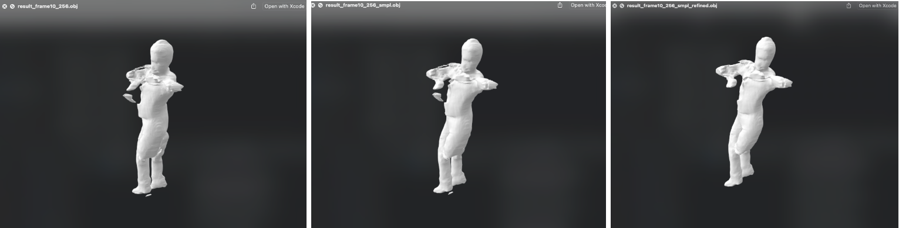
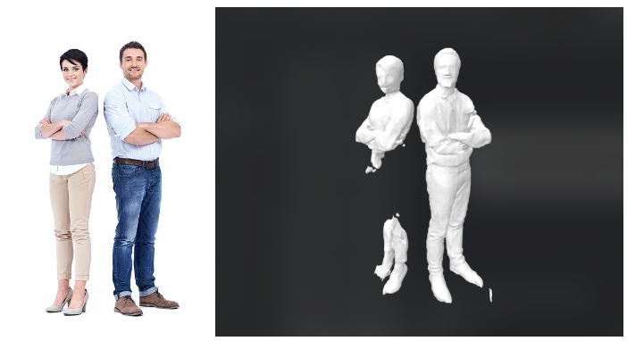

## Monocular Video to 3D reconstruction

For getting a 3D point in camera coordinate system, say X from a 2D point x we 
need the projection matrix, and with the camera instrinsics & extrinsics 
we compute (X, Y, Z, 1) in homonogeneous coordinates from a 2D point (x, y, 1).

Now there are machine learning techniques, and networks that 
allows direct estimation of the corresponding 3D object. We will evaluate multiple
methodologies & implement one of them and compare.


### Setup project

1. Run the following to setup the project locally or after cloning it in colab

```shell
bash scripts/setup.sh
```

2. Download the input videos for use.

N.B.: This works with CUDA 10.2 and Pytorch 1.9 and uses conda to install dependencies. 


### CLI

To use the cli please install it with `pip install -e .`, while in the root directory of the project.

After installation you'll be able to use it with the command `metacast`, and here's a list of options it takes: 

```shell

Usage: metacast [OPTIONS]

Options:
  -i, --input_video TEXT          Input MP4 file  [required]
  -o, --output_dir DIRECTORY      Directory to store OBJ files.  [required]
  -r, --resolution INTEGER        Resolution  [default: 256]
  -f, --fps INTEGER               Sampling FPS from video (This is not the
                                  input video fps)  [default: 24]
  -g, --gpu_id INTEGER            GPU id  [default: 0]
  -c, --meshclean / --no-meshclean
                                  [default: no-meshclean]
  -p, --process / --no-process    [default: no-process]
  -h, --help                      Show this message and exit.  [default:
                                  False]
```

E.g. - 

```shell
metacast -i <path-to-mp4-file> --output_dir=results -r 256  --fps 24 --gpu_id 0 --meshclean
```

This will do the following:

1. Convert the mp4 video into frames (based on the fps provides in the CLI)
2. Pre-process it to generate skeletal keypoints
3. Reconstruct the mesh from the sdf predicted by the network (Used PifuHD)
4. Save it to obj file


If `--meshclean` is provided it also does the following:

1. Uses open3d to cleanup the mesh
2. Computes the connected components and removes the outliers.

Here's an example:




For multi-person I tested with 1 frame without any mesh-cleanup  and here are the results:



The models are available in the `results_mini/` directory.

#### Results:

Some of the results i.e. final obj and dae files are provided in the 
[results_mini/](results_mini) directory.

```shell
.
└── pifuHD
    └── FigureSkater
        ├── result_frame0_256.obj
        ├── result_frame0_256.png
        ├── result_frame0_256_smpl.obj
        └── result_frame0_256_smpl_refined.obj
```

For full results, download from here - [Google Drive Link](https://drive.google.com/file/d/1eO4oK8gjZAwKhFHdgoeEe8zK3VDcq-o4/view?usp=sharing)

### Unity Playthrough

[github.com/sladebot/3d_reconstruction_unity](https://github.com/sladebot/3d_reconstruction_unity)

I mostly evaluated models generated from PifuHD. Created a custom shader
for using the vertex colors that Pifu for reading the RGB values encoded
in the vertices and update the material.

For animating each video I imported all the 3D objects from the frames at the given
frame rate, and enable them one at a time using a script in Unity. So what it
does is basically - 

1. Use `meshlab` or `meshlabserver` to convert from obj to dae (Makes ure to add the 
   option vn for normals and vc for colors)
2. Run it for each obj file
3. There's a script if you want to do it in one shot. [scripts/obj2dae.sh](scripts/obj2dae.sh)

e.g. - `./scripts/obj2dae.sh <dir-to-obj-files>`

The entire project is checked into PlasticSCM at: [reconstruction@souranil_unity894@cloud] as well


Unity Animation Videos:

* [JumpingJacks | PifuHD](videos/JumpingJacks-PifuHD.mov)
* [FigureSkater | ICON](videos/FigureSkater-ICON.mov)
* [SkateBoarder | ICON](videos/SkateBoarder-ICON.mov)

Scenes:
* Comparison: Comparing models generated from various models like PIFU, PIFUHD, ICON etc.
* FigureSkater-ICON
* JumpingJacks-PIFUHD
* JumpingJack-ICON
* SkateBoarder-ICON


## Considerations

[PiFU](https://arxiv.org/pdf/2004.00452.pdf) was a good start, and I evaluated a few other approaches that were out
there - 

1. ICON
2. PHORHUM
3. PAMIR
4. ARCH++
5. PifuHD

Some parameters that I evaluated were:
---
- Inputs: masks needed, priors required(e.g. SMPL)
- Outputs: surface normals, vertex color along with sdf
- Availability: Are model checkpoints made available, community, Github/website.


> The approach you chose, why you chose it, and how it works in high-level terms
PiFU was able to provide provide predictions for vertex colors which were then used for reconstructing
the mesh. 

PiFU HD on the other hand doesn't but has better performance over PiFU and met most of the availability
criteria so I was able to re-use a lot of things. 

ICON was a good candidate and I did test it out, and their models which were predicted with a SMPL-X prior
were pretty great.

PHORUM seems very promising but didn't meet the availability criterias.

I finally went with PifuHD becuase I had a good understanding of how PiFU architecture works, and how they're
using the multi-level network to get coarse and fine level structures.

> The limitations of your approach, and how you would mitigate them. For instance,
does it work with multiple people? In real-time? With motion/objects in the scene?

Given that we have the keypoints for people in the image, we should be able to use that to generate 3d models
for multiple people in the image but I didn't test it out.

This is not end-to-end trainable in a real sense because we have to reconstruct the mesh, from the sdf, refine
it if required and remove outliers before exporting it. This will also add time if this is required for
real-time predictions. Additionally, it doesn't provide pixel level color information as well. We can probably
use the texture network of PiFU and use the RGB predictions. 

For motion in the scene, it definitely suffers. This may be mitigated by using multi-view images for the same 
frame for the 3d model reconstruction. Currently predicting the accurate geometry of the back of the people
is an ill-poised problem and has to be entirely inferred by the implicit function represented by the MLP.

As one of its limitations, this doesn't support pixel colors out of the box, we can probably use the Pifu predictions,
and use that.

Additionally PHORUS provides all of the above requirements, so I'd also keep an eye on that. 

> A brief statement on how you would write a test suite for your video converter.
e.g. how would you validate that your outputs are reasonable?

Given there are multiple steps to this process, it would be great to keep track of some performance metrics of the model
like chamfer distance, normal, point-to-surface distance to measure the performace of the trained model. We can also keep
checks like how the meshes connected components are to check how well we can refine the meshes post reconstruction. For
validating along with some visual inspection, we can keep certain mesh evaluation metrics to check if the generated
objects are completely out misconstrued. We can also use SMPL models to check if they're withing a certain threshold of
deformation. Using SMPL-X priors worked great for ICON model reconstruction, so it might work out great as a testing strategy as well.


#### Appendix
==============

PifuHD (Used)

- [Paper](https://arxiv.org/pdf/2004.00452.pdf)
- [Repo](https://github.com/facebookresearch/pifuhd)

ICON (Evaluated)

- [Paper](https://arxiv.org/pdf/2112.09127.pdf)
- [Repo](https://github.com/yuliangxiu/icon)


